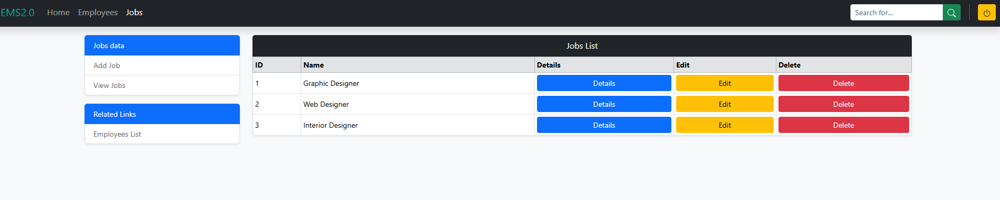
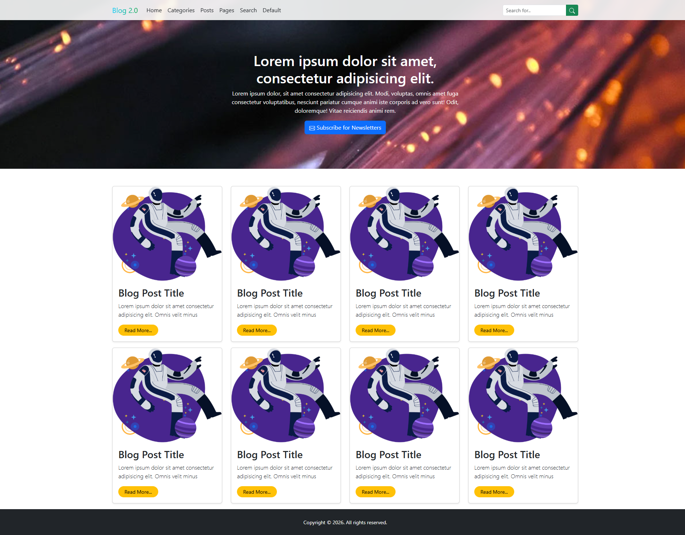

# 🎓 Bootstrap 5 Mastery: Course Projects & Exercises

This repository serves as a comprehensive collection of my work throughout the **"The Ultimate Bootstrap Guide"** course. It contains hands-on exercises, UI experiments, and full-scale web applications designed to master **Bootstrap 5 Layouts, Forms, Components, and Advanced Helpers.**

---

## 📂 Featured Projects

### 1. Employee Management System (EMS) 🚀

**Status: Complete ✅**
The EMS Dashboard focuses on creating a data-rich environment that remains clean and legible across all device types. It highlights administrative workflows and data density.

### 2. Multi-Page Blog CMS ✍️

**Status: Complete ✅**
A sophisticated, content-heavy blog application featuring a magazine-style layout. This project focuses on multi-page architecture, content categorization, and complex sidebar integrations.

---

## 🔗 Live Demos & Screenshots

| Project           | Live Link                                                     |
| :---------------- | :------------------------------------------------------------ |
| **EMS Dashboard** | [Click to View Live](https://ems-project-1.netlify.app/)      |
| **Blog App**      | [Click to View Live](https://blog-app-bootstrap.netlify.app/) |

#### **Project 1: EMS Preview**



#### **Project 2: Blog App Preview**



---

## 🛠️ Technical Highlights

### **Project 1: EMS Power Features**

- **Advanced Grid:** Utilizing `row-cols-*` for responsive card decks.
- **Form Architecture:** Professional data-entry points with **Floating Labels** and **Input Groups**.
- **Utility-First Approach:** Massive reduction in custom CSS by leveraging Bootstrap's spacing, typography, and border utilities.

### **Project 2: Blog App Features**

This project pushed the boundaries of content layout and navigation:

- **Multi-Page Architecture:** Managed separate layouts for the Home, Posts, Categories, and Search results pages.
- **Advanced Layouts:** Combined **Bootstrap Grid** and **Flexbox** to create magazine-style "Featured Post" banners and sidebars.
- **Interactive Components:**
  - **Modals:** Used for quick-add actions (Add Category, Add Post).
  - **Pagination:** Implemented clean navigation for browsing multiple pages of posts.
  - **Breadcrumbs:** Enhanced user navigation depth.
- **Marketing Elements:** Built a conversion-focused **Newsletter Signup** section and a functional **Search Bar** interface.

---

## 📈 Learning Roadmap

- [x] **Module 1: Layouts** (Containers, Grid, Breakpoints, Z-index)
- [x] **Module 2: Forms** (Layouts, Validation, Floating Labels)
- [x] **Project 1: EMS Dashboard** (Build Complete ✅)
- [x] **Module 3: Components** (Navbars, Modals, Pagination)
- [x] **Project 2: Blog CMS** (Build Complete ✅)
- [x] **Module 4: Helpers & Utilities** (Stacks, Ratios, Position)
- [x] **Module 5: Customization** (Sass, Variable Overrides, API)

---

## 💻 How to Run This Repo

1. **Clone the repository:**
   ```bash
   git clone https://github.com/Sobuj54/learning-bootstrap.git
   ```
